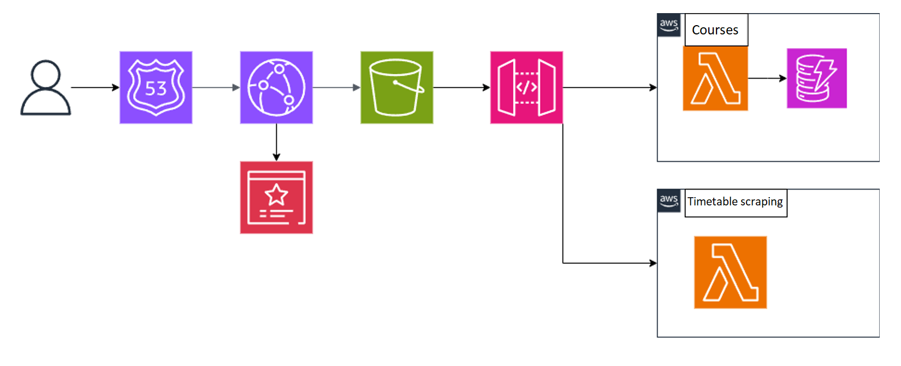

# TimetablesV2

TimetablesV2 is a web application that enhances the original ATU timetables website, making it more accessible and mobile-friendly. Under the hood it is a cloud-first application hosted on AWS. 

### Live Demo
~~Check out the [live demo](https://timetables-v2.onrender.com/timetable/SG_KSODV_H08%2FF%2FY2%2F1%2F(B)?date=2024-09-18&view=Week) (currently not hosted on AWS due to lack of resources (money))~~. 

Currently unavailable, the website from which the scraping was done is no longer available. I might add some mock data or figure out scraping with cookies in the near future.
 
It is worth noting that there are periods of time with no lessons, like the summer/winter holidays, easter break, reading week, etc. so if you don't see anything there might simply be no lessons to display.
 

## Architecture

The frontend hosted on S3, connected to Cloudfront and Route53, with an access to the backend through API gateway. On the backend side we have 2 main components, a lambda for scraping the timetable data, and another lambda for retrieving the information about the available courses from DynamoDB.

 
## Technologies used
- `rust` - the scraping lambda (speed and type safety)
- `nodejs` - the courses lambda (simplicity)
- `react` - frontend framework
- `react-router` - client-side routing
- `material ui` - a clean look
- `devexpress react scheduler` - a quick calendar display
- `fusejs` - search functionality
- `zustand` - state management
- `postman` - api testing
- `pingdom` - cloudfront testing

## Going forward

As this was made for a college project, it is now in a finished state. However, in the future a new TimetablesV3 webapp might be created. If everything goes well, it could become a mobile app too, using for example React Native. There are some UX mishaps (and other misc bugs) which could be corrected when working on a new potential app. The architecture could also be optimized and accommodate additional features, such as a free room finder. The repo itself could also be kept a bit more tidy.

Original timetables vs TimetablesV2 on mobile.

*PS. We still appreciate the original timetables*
